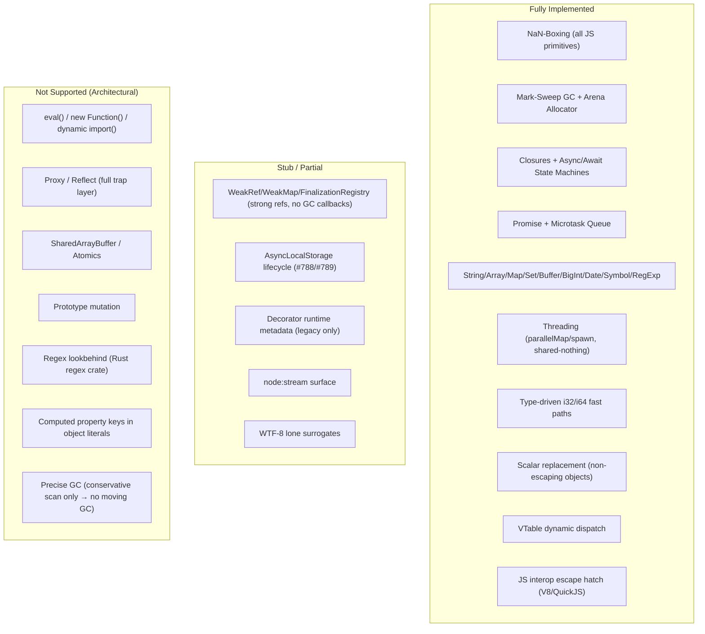

# Perry: Type Lowering & Native Runtime Support — Full Findings & Gaps

---

## 1. Type Lowering Pipeline

Perry's type system flows from TypeScript annotations through HIR to native code. Types are **erased** before final machine code, but they drive optimization decisions throughout the pipeline.

### HIR Type Representation

The `LoweringContext` in `perry-hir` infers types during AST→HIR lowering via `infer_type_from_expr`:

| TypeScript Type | HIR Type | Runtime Representation |
|---|---|---|
| `number` | `Type::Number` | Raw `f64` (IEEE 754 double) |
| `string` | `Type::String` | Pointer to `StringHeader` (NaN-boxed `STRING_TAG 0x7FFF`) |
| `boolean` | `Type::Boolean` | `TAG_TRUE/TAG_FALSE` singletons |
| `bigint` | `Type::BigInt` | Pointer to `BigIntHeader` (`BIGINT_TAG 0x7FFA`) |
| `class T` | `Type::Named(name)` | Pointer to `ObjectHeader` with `class_id` (`POINTER_TAG 0x7FFD`) |
| `any` / `unknown` | `Type::Any` | Dynamic NaN-boxed `f64` |
| `T[]` | `Type::Array(elem)` | Pointer to `ArrayHeader` |
| `i32` (inferred) | `Type::Int32` | Parallel `i32` alloca slot | [1](#0-0) [2](#0-1)

### Generics: Monomorphization

Perry implements generics via monomorphization — each unique type instantiation produces a specialized function/class with mangled names (e.g., `identity$number`). The `MonomorphizationContext` uses work queues to recursively specialize dependencies. [3](#0-2)

---

## 2. NaN-Boxing: The Universal Value Representation

All JS values are represented as 64-bit `f64` (`JSValue`). The top 16 bits encode the type tag; the bottom 48 bits carry the payload (pointer, integer, or SSO data).

```
Bit 63:    Sign (always 0 for tagged values)
Bits 62-48: Type tag
Bits 47-0:  Payload (pointer / integer / SSO bytes)
```

| Tag Constant | Value | Meaning |
|---|---|---|
| `TAG_UNDEFINED` | `0x7FFC_0000_0000_0001` | `undefined` singleton |
| `TAG_NULL` | `0x7FFC_0000_0000_0002` | `null` singleton |
| `TAG_FALSE` | `0x7FFC_0000_0000_0003` | `false` |
| `TAG_TRUE` | `0x7FFC_0000_0000_0004` | `true` |
| `TAG_HOLE` | `0x7FFC_0000_0000_0010` | Sparse array sentinel |
| `POINTER_TAG` | `0x7FFD` | Object/Array/Symbol heap pointer |
| `INT32_TAG` | `0x7FFE` | 32-bit signed integer |
| `STRING_TAG` | `0x7FFF` | Heap `StringHeader` pointer |
| `SHORT_STRING_TAG` | `0x7FF9` | SSO: ≤5 bytes inline in payload |
| `BIGINT_TAG` | `0x7FFA` | Heap `BigIntHeader` pointer |
| `JS_HANDLE_TAG` | `0x7FFB` | Handle into V8/QuickJS heap | [4](#0-3)

### Codegen Fast Paths from Types

When the compiler knows a value's type statically, it bypasses the full NaN-boxing overhead:

- **i32 fast path**: Locals proven to be integer-valued (via `collect_integer_locals`, `collect_strictly_i32_bounded_locals`) get a parallel `i32` alloca slot. Loop counters, bitwise ops, and `| 0` coercions qualify. This eliminates `fptosi/sitofp` round-trips per iteration.
- **Bounds elimination**: `for (let i = 0; i < arr.length; i++) arr[i]` — the compiler caches `arr.length` once and records `(i, arr)` in `bounded_index_pairs`, emitting raw `getelementptr + load` without runtime bounds checks.
- **Integer modulo**: `%` on provably-integer operands emits `fptosi → srem → sitofp` instead of `fmod` (a libm call on ARM — ~30ns vs ~1 cycle).
- **Inline `.length`**: `PropertyGet` for `.length` on arrays/strings unboxes the pointer and loads from offset 0 directly.
- **Numeric class fields**: `this.value + 1` where `value: number` skips `js_number_coerce` wrapping, enabling LLVM GVN/LICM.
- **Scalar replacement**: Non-escaping object literals, array literals, and `new` expressions are decomposed into per-field stack allocas — zero heap allocation. [5](#0-4) [6](#0-5) [7](#0-6) [8](#0-7)

---

## 3. Runtime Built-in Type Support

### String (`StringHeader`)

- UTF-8 (WTF-8 for lone surrogates) heap-allocated with `utf16_len`, `byte_len`, `capacity`, `refcount`, `flags`.
- **SSO**: strings ≤5 bytes encoded inline in the NaN-box payload — no heap allocation.
- **In-place append**: `refcount == 1` enables O(n) amortized `js_string_append` instead of always-allocating `js_string_concat`.
- **Chain optimization**: `a + b + c` collapses to `js_string_concat_chain` (single allocation).
- SIMD-optimized operations (NEON/SSE2 for string scanning). [9](#0-8)

### Array (`ArrayHeader`)

- Inline elements (NaN-boxed `f64`) follow the header in memory.
- `length` and `capacity` at fixed offsets for inline codegen.
- Numeric arrays can be "downgraded" to typed `f64[]` for SIMD vectorization.

### BigInt (`BigIntHeader`)

- 1024-bit (16 × `u64` limbs, little-endian). Sized for secp256k1 intermediate products.
- Allocated from arena bump allocator (not `gc_malloc`) for lower overhead. [10](#0-9)

### Map / Set

- `MapHeader` + `SetHeader` with side-table indices: `MAP_INDEX` (numeric keys), `MAP_STRING_INDEX` (FNV-1a content hashes for GC-safe string lookup), `SET_INDEX`.
- O(1) average lookup; content-based equality for strings.

### Buffer (`BufferHeader`)

- Layout matches `ArrayHeader` (length at offset 0, capacity at offset 4).
- Small buffer slab allocator for buffers < 256 bytes.
- `BUFFER_REGISTRY`, `ARRAY_BUFFER_REGISTRY`, `BUFFER_AB_ALIAS` for `instanceof` and aliasing checks.

### Date

- Stored as raw `f64` timestamp. `DATE_REGISTRY` tracks bit patterns for `instanceof Date`. Invalid Date = `DATE_NAN_BITS` (`0x7FF8_0000_0000_0DA7`). [11](#0-10)

### Symbol

- `SymbolHeader` allocated on heap, tagged with `POINTER_TAG`. `Symbol.for` / `Symbol.keyFor` supported via a global registry.

### RegExp (`RegExpHeader`)

- Backed by Rust's `regex` crate. Stores compiled `Regex`, original pattern/flags, and `last_index` for stateful execution. [12](#0-11)

---

## 4. Object Model & Dynamic Dispatch

### `ObjectHeader` Layout

Every heap object has: `object_type` (u32), `class_id` (u32), `field_count` (u32), `keys_array` pointer. Inline property slots follow immediately in memory.

- **Shape caching**: Objects with the same key set share a `keys_array` pointer.
- **`KEYS_INDEX`**: FNV-1a hash map built when `keys_array.length > 32` for O(1) lookup.
- **`OVERFLOW_FIELDS`**: TLS `PtrHashMap<usize, Vec<u64>>` for dynamically-grown objects. [13](#0-12)

### VTable / Dynamic Dispatch

`CLASS_VTABLE_REGISTRY` maps `class_id` → `ClassVTable` (method name → function pointer). `js_native_call_method` is the dispatch entry point:

1. `JS_HANDLE_TAG` → V8/QuickJS bridge
2. Class object → `js_class_static_method_call`
3. VTable lookup → direct `func_ptr` call
4. Prototype objects → `CLASS_PROTOTYPE_OBJECTS` synthetic class IDs [14](#0-13)

---

## 5. GC & Memory Management

### Dual-Track Allocation

| Track | Types | Strategy |
|---|---|---|
| Arena (bump-pointer) | `GC_TYPE_ARRAY`, `GC_TYPE_OBJECT`, `GC_TYPE_LAZY_ARRAY` | 1 MB thread-local blocks, linear walk for discovery |
| Malloc (mimalloc) | `GC_TYPE_STRING`, `GC_TYPE_CLOSURE`, `GC_TYPE_PROMISE`, `GC_TYPE_MAP` | Tracked in `MALLOC_STATE` |

Every allocation is preceded by an 8-byte `GcHeader`: `obj_type` (u8), `gc_flags` (u8), `_reserved` (u16), `size` (u32). [15](#0-14)

### Mark-Sweep Collector

- **Mark**: precise shadow stack roots + `MALLOC_STATE` + conservative C-stack scan (any bit pattern matching a heap address is treated as a root → "pinned").
- **Sweep**: malloc objects without mark bit are freed; arena blocks without live objects are reset.
- **Write barriers**: emitted by codegen for property/array stores to track old→young references. [16](#0-15) [17](#0-16)

---

## 6. Closures, Async, & Event Loop

### Closures

`ClosureHeader`: `func_ptr` (usize), `capture_count` (u32, high bit = `CAPTURES_THIS_FLAG`), `type_tag` (`CLOSURE_MAGIC 0x434C_4F53`), variadic `captures[]` (u64 slots). Mutable captures are heap-boxed. Side-tables: `CLOSURE_REST_REGISTRY`, `CLOSURE_ARITY_REGISTRY`, `DISPATCH_CACHE`.

### Async/Await

Lowered in two passes:
1. `transform_async_to_generator`: `await` → `yield`, marks `is_generator = true`, `was_plain_async = true`.
2. `transform_generators`: converts to a `while(true)` + `if (__state === N)` state machine. [18](#0-17)

### Promise & Microtask Queue

`js_promise_run_microtasks` drains the microtask queue. Uses `setjmp` to catch throws from callbacks and reject the chained promise without exiting the loop. `MT_STEP_CHAIN_REUSE_HIT` optimization avoids fresh Promise allocations during `await` chains. [19](#0-18)

### Async Bridge (Rust Futures → TS Promises)

Tokio worker threads cannot allocate JS objects (thread-local arenas). Results go through `PENDING_DEFERRED` with a `converter` closure that runs on the main thread. Promises are pinned (`GC_FLAG_PINNED`) while a tokio worker holds them. [20](#0-19)

### Event Loop

`js_wait_for_event` blocks on a `Condvar` until a timer deadline or `js_notify_main_thread` signal. Adaptive spin-throttle prevents 100% CPU on past-deadline timers.

### Threading

Shared-nothing: each thread has its own arena + GC. Values cross boundaries via `SerializedValue` (deep copy). `parallelMap`, `parallelFilter`, `spawn`. No `SharedArrayBuffer` or `Atomics`. [21](#0-20)

---

## 7. JS Interop Escape Hatch

When Perry cannot compile a module natively, `--enable-js-runtime` embeds V8/QuickJS. JS objects are represented as `JS_HANDLE_TAG` NaN-boxed values. `JS_HANDLE_CALL_METHOD`, `JS_HANDLE_ARRAY_GET`, `JS_HANDLE_OBJECT_GET_PROPERTY` are function pointers registered by the JS runtime bridge. [22](#0-21)

---

## 8. Gaps in the AOT Runtime

The following are confirmed gaps, stubs, or architectural limitations for a **complete** AOT TypeScript runtime:

### A. Weak Reference Semantics (Stub)

`WeakRef`, `WeakMap`, `WeakSet`, and `FinalizationRegistry` expose the correct API shape but are **not GC-accurate**. `WeakRef` holds a **strong** reference internally. `FinalizationRegistry` records registrations but **never fires cleanup callbacks**. The GC's mark phase does not track weak references. [23](#0-22)

### B. `AsyncLocalStorage` / `async_hooks` — Partial

`AsyncLocalStorage` and `async_hooks.createHook` have native runtime implementations, but CLAUDE.md explicitly flags `#788` (real `AsyncLocalStorage` tracking across `await`/microtasks/timers) and `#789` (real `async_hooks.createHook` lifecycle + asyncId) as open issues — today these are described as "name-only stubs" for the full lifecycle semantics. [24](#0-23)

### C. `Proxy` / `Reflect` — Not Supported

`Proxy` is not a full engine-level trap layer. `Reflect.metadata` and general `Reflect` API calls outside decorator syntax are unsupported. `Object.setPrototypeOf` is modeled as a no-op (Perry's class IDs are baked at allocation time). [25](#0-24)

### D. `eval()` / `new Function()` / Dynamic `import()` — Not Supported

AOT compilation is fundamentally incompatible with runtime code generation. Dynamic `require()` and `await import()` are also unsupported; only static ESM imports are allowed. [26](#0-25)

### E. `SharedArrayBuffer` / `Atomics` — Not Supported

Perry's shared-nothing threading model (deep-copy across boundaries) is architecturally incompatible with `SharedArrayBuffer`. No `Atomics` support. [27](#0-26)

### F. Regex Lookbehind — Categorical Gap

Rust's `regex` crate does not support lookbehind assertions (`(?<=)` / `(?<!)`). This is a hard categorical gap — it requires replacing the regex engine. [28](#0-27)

### G. Computed Property Keys in Object Literals — Not Supported

`const obj = { [key]: value }` is not supported. The workaround is `obj[key] = value` post-construction. [29](#0-28)

### H. Prototype Mutation — Not Supported

`MyClass.prototype.newMethod = function() {}` and `Object.setPrototypeOf` do not mutate Perry's fixed class layout. Classes compile to fixed structures with baked-in `class_id`s. [30](#0-29)

### I. Decorator Runtime Metadata — Partial

Legacy class/method/property decorators emit `design:paramtypes` and `design:type`. However, accessor decorators, descriptor replacement, class replacement (returning a new constructor), and full Angular/NestJS/TypeORM DI metadata flows are unsupported. [31](#0-30)

### J. GC Precision — Conservative Stack Scan

The current GC uses conservative stack scanning: any bit pattern on the C stack matching a heap address is treated as a root and the object is "pinned." This prevents a moving/compacting GC and causes over-retention. The roadmap (tracked in `docs/generational-gc-plan.md` and `docs/memory-perf-roadmap.md`) requires a precise shadow stack (codegen-emitted per-safepoint) before a true generational or compacting GC is possible. [32](#0-31)

### K. Object Escape Analysis — Limited Scope

Scalar replacement (stack allocation of non-escaping objects) currently fires only when the object is accessed exclusively via field get/set. Any method call defeats it. This means `let p = new Point(x, y); p.toString()` still heap-allocates, unlike Rust/C++/Go which can stack-allocate and dead-code-eliminate the entire loop. [33](#0-32)

### L. `console.dir` / `console.group*` — Not Implemented

Formatting for `console.dir` and `console.group*` is a known categorical gap. [28](#0-27)

### M. WTF-8 Lone Surrogate Handling — Partial

Lone surrogate handling in WTF-8 strings is a known categorical gap. The `STRING_FLAG_HAS_LONE_SURROGATES` flag exists but full spec-compliant handling is incomplete. [28](#0-27)

### N. `node:stream` / `node:stream/web` — Incomplete

`node:stream` and `node:stream/web` (WHATWG streams) surfaces are not fully implemented, tracked as module-inventory gaps in `known_failures.json`. [34](#0-33)

### O. Custom Error Subclasses — Limited

`Error` and basic `throw`/`catch` work, but custom error subclasses have limited support. [35](#0-34)

---

## Summary Diagram



### Citations

**File:** crates/perry-hir/src/lower_types.rs (L13-59)
```rust
pub(crate) fn infer_type_from_expr(expr: &ast::Expr, ctx: &LoweringContext) -> Type {
    match expr {
        // Literals
        ast::Expr::Lit(lit) => match lit {
            ast::Lit::Num(_) => Type::Number,
            ast::Lit::Str(_) => Type::String,
            ast::Lit::Bool(_) => Type::Boolean,
            ast::Lit::BigInt(_) => Type::BigInt,
            ast::Lit::Null(_) => Type::Null,
            ast::Lit::Regex(_) => Type::Named("RegExp".to_string()),
            _ => Type::Any,
        },

        // Template literals are always strings
        ast::Expr::Tpl(_) => Type::String,

        // Array literals → infer element type from first element
        ast::Expr::Array(arr) => {
            let elem_ty = arr
                .elems
                .iter()
                .find_map(|e| e.as_ref().map(|elem| infer_type_from_expr(&elem.expr, ctx)))
                .unwrap_or(Type::Any);
            Type::Array(Box::new(elem_ty))
        }

        // Variable reference → look up known type
        ast::Expr::Ident(ident) => {
            let name = ident.sym.as_ref();
            ctx.lookup_local_type(name).cloned().unwrap_or(Type::Any)
        }

        // Binary operators
        ast::Expr::Bin(bin) => {
            use ast::BinaryOp::*;
            match bin.op {
                // Comparison/equality operators always return boolean
                EqEq | NotEq | EqEqEq | NotEqEq | Lt | LtEq | Gt | GtEq | In | InstanceOf => {
                    Type::Boolean
                }

                // Addition: string if either side is string, else number if both number
                Add => {
                    let left = infer_type_from_expr(&bin.left, ctx);
                    let right = infer_type_from_expr(&bin.right, ctx);
                    if matches!(left, Type::String) || matches!(right, Type::String) {
                        Type::String
```

**File:** crates/perry-codegen/src/type_analysis.rs (L589-674)
```rust
pub(crate) fn is_numeric_expr(ctx: &FnCtx<'_>, e: &Expr) -> bool {
    match e {
        Expr::Integer(_) | Expr::Number(_) => true,
        Expr::Uint8ArrayGet { .. }
        | Expr::BufferIndexGet { .. }
        | Expr::Uint8ArrayLength(_)
        | Expr::BufferLength(_) => true,
        Expr::LocalGet(id) => matches!(
            ctx.local_types.get(id),
            Some(HirType::Number) | Some(HirType::Int32)
        ),
        // NOTE: Expr::Compare is NOT numeric — it produces a NaN-boxed
        // TAG_TRUE/TAG_FALSE which `fcmp one cond, 0.0` would handle
        // incorrectly (NaN compared with 0.0 is unordered → false).
        // Comparisons go through the slow path (js_is_truthy) which
        // dispatches on the NaN tag.
        //
        // For Add: only numeric when BOTH operands are statically
        // numeric (otherwise it could be string concatenation). The
        // recursive check is critical for nested arithmetic like
        // `sum + p.x + p.y` which parses as `((sum + p.x) + p.y)` —
        // the inner Add must be recognized as numeric for the outer
        // Add to also be numeric, otherwise the outer one wraps the
        // inner result in `js_number_coerce` and prevents LLVM from
        // doing GVN/LICM on the chain.
        Expr::Binary {
            op: BinaryOp::Add,
            left,
            right,
        } => is_numeric_expr(ctx, left) && is_numeric_expr(ctx, right),
        Expr::Binary { op, .. } => !matches!(op, BinaryOp::Add),
        Expr::Update { .. } => true,
        Expr::DateNow => true,
        // `obj.field` where the field is declared as `number` on the
        // owning class. Without this, `this.value + 1` in a hot loop
        // wraps the field load in `js_number_coerce` which prevents
        // LLVM from doing GVN/LICM on the load. The class field
        // walker matches `class_field_global_index`'s inheritance
        // traversal so the type of any inherited field is also seen.
        Expr::PropertyGet { object, property } => {
            let Some(owner_class_name) = receiver_class_name(ctx, object) else {
                return false;
            };
            let mut current = ctx.classes.get(owner_class_name.as_str()).copied();
            while let Some(cls) = current {
                if let Some(f) = cls.fields.iter().find(|f| f.name == *property) {
                    return matches!(f.ty, HirType::Number | HirType::Int32);
                }
                current = cls
                    .extends_name
                    .as_deref()
                    .and_then(|p| ctx.classes.get(p).copied());
            }
            false
        }
        // `arr[i]` where `arr` is statically `number[]` / `Int32[]`.
        // Without this, `sum + arr[i]` in a hot loop wraps the element
        // load in `js_number_coerce` which blocks LLVM's vectorizer
        // and adds a function call per iteration.
        Expr::IndexGet { object, .. } => {
            let Expr::LocalGet(arr_id) = object.as_ref() else {
                return false;
            };
            match ctx.local_types.get(arr_id) {
                Some(HirType::Array(elem)) => {
                    matches!(**elem, HirType::Number | HirType::Int32)
                }
                _ => false,
            }
        }
        // User function calls returning Number: skip js_number_coerce.
        // Without this, `fib(n-1) + fib(n-2)` wraps both results in
        // js_number_coerce — ~4 billion wasted runtime calls on fib(40).
        Expr::Call { callee, .. } => {
            if let Expr::FuncRef(fid) = callee.as_ref() {
                ctx.func_signatures
                    .get(fid)
                    .map(|(_, _, returns_number)| *returns_number)
                    .unwrap_or(false)
            } else {
                false
            }
        }
        _ => false,
    }
}
```

**File:** crates/perry-runtime/src/value/jsvalue.rs (L26-103)
```rust
    }

    /// Create a boolean value
    #[inline]
    pub const fn bool(value: bool) -> Self {
        Self {
            bits: if value { TAG_TRUE } else { TAG_FALSE },
        }
    }

    /// Create an f64 number value
    #[inline]
    pub fn number(value: f64) -> Self {
        // Just reinterpret the bits - f64 values are stored directly
        Self {
            bits: value.to_bits(),
        }
    }

    /// Create an i32 value (stored in payload, faster than f64 for integers)
    #[inline]
    pub const fn int32(value: i32) -> Self {
        Self {
            bits: INT32_TAG | ((value as u32) as u64),
        }
    }

    /// Create a pointer value (for heap-allocated objects)
    #[inline]
    pub fn pointer(ptr: *const u8) -> Self {
        debug_assert!(
            (ptr as u64) <= POINTER_MASK,
            "Pointer too large for NaN-boxing"
        );
        Self {
            bits: POINTER_TAG | (ptr as u64 & POINTER_MASK),
        }
    }

    /// Check if this is a number (not a tagged value)
    #[inline]
    pub fn is_number(&self) -> bool {
        // Perry-owned tags occupy the positive qNaN band 0x7FF9..=0x7FFF.
        // Keep IEEE f64 values, including canonical qNaN 0x7FF8 and negative
        // NaN payloads, classified as numbers.
        let tag = self.bits & TAG_MASK;
        !(SHORT_STRING_TAG..=STRING_TAG).contains(&tag)
    }

    /// Check if this is undefined
    #[inline]
    pub fn is_undefined(&self) -> bool {
        self.bits == TAG_UNDEFINED
    }

    /// Check if this is null
    #[inline]
    pub fn is_null(&self) -> bool {
        self.bits == TAG_NULL
    }

    /// Check if this is a boolean
    #[inline]
    pub fn is_bool(&self) -> bool {
        self.bits == TAG_TRUE || self.bits == TAG_FALSE
    }

    /// Check if this is an int32
    #[inline]
    pub fn is_int32(&self) -> bool {
        (self.bits & !INT32_MASK) == INT32_TAG
    }

    /// Check if this is a pointer (object or array)
    #[inline]
    pub fn is_pointer(&self) -> bool {
        (self.bits & !POINTER_MASK) == POINTER_TAG
    }
```

**File:** crates/perry-runtime/src/value/jsvalue.rs (L106-130)
```rust
    /// (STRING_TAG only — inline SSO values return false). This is
    /// the legacy predicate that most call sites rely on: they
    /// follow `is_string()` with `as_string_ptr()` assuming a real
    /// `*mut StringHeader`. Keeping this strict avoids a massive
    /// audit during the SSO rollout; use `is_any_string()` when
    /// you want to accept both representations.
    ///
    /// ⚠ #1781 footgun — do NOT write
    /// `if v.is_string() { /* read ptr */ } else { /* treat as pointer
    /// / number / array */ }`. An inline SSO short string (len 0..=5,
    /// `SHORT_STRING_TAG = 0x7FF9`) fails this STRICT check and falls into
    /// the else-branch, where its payload bytes get masked to 48 bits and
    /// dereferenced (SIGSEGV — the fault address spells the string) or
    /// silently produce a wrong result. This blind spot has been patched
    /// piecemeal at least five times (Buffer.from, querystring, str.replace,
    /// js_is_truthy, the #1781 batch). When a value can be *any* runtime
    /// string, branch on [`is_any_string`](Self::is_any_string) +
    /// [`is_short_string`](Self::is_short_string) (decode via
    /// [`short_string_to_buf`](Self::short_string_to_buf)), or route the
    /// whole value through `js_get_string_pointer_unified`, which
    /// materializes SSO bytes onto the heap so downstream `*StringHeader`
    /// code is unchanged. Reading keys out of a `keys_array` is the one
    /// safe exception: stored keys are always heap `STRING_TAG`.
    #[inline]
    pub fn is_string(&self) -> bool {
```

**File:** crates/perry-codegen/src/expr/mod.rs (L495-516)
```rust
    /// where `(i, arr)` is in the set, the IndexSet skips its
    /// runtime bound check + cap check + realloc fallback entirely
    /// and emits a single inline-store sequence.
    ///
    /// The for-loop guarantees `i < arr.length` is true at the cond
    /// check, and `stmt_preserves_array_length` already proved the
    /// body can't change `arr.length` or reassign `i`, so the
    /// IndexSet site can rely on `i < arr.length` without rechecking.
    pub bounded_index_pairs: Vec<BoundedIndexPair>,

    /// Parallel i32 counter slots for integer loop counters that are
    /// used as bounded array indices. When a for-loop counter is in
    /// `integer_locals` AND appears in `bounded_index_pairs`, `lower_for`
    /// allocates a parallel i32 alloca tracked here. The `Expr::Update`
    /// lowering increments the i32 slot alongside the normal double slot,
    /// and the IndexGet/IndexSet bounded fast-path loads the i32 directly
    /// instead of emitting a `fptosi double → i32` on every iteration.
    ///
    /// Eliminates ~3 cycles per iteration on M-series (fcvtzs latency)
    /// on hot array-walking loops like `for (let i = 0; i < arr.length;
    /// i++) arr[i] = expr`.
    pub i32_counter_slots: std::collections::HashMap<u32, String>,
```

**File:** crates/perry-codegen/src/stmt/let_stmt.rs (L612-682)
```rust
    // Int32 specialization (issue #48): if this local qualifies as
    // integer-valued (all writes are `| 0` / `>>> 0` / bitwise / int
    // literal / ++/--), allocate a parallel i32 slot. Update/LocalSet
    // mirror writes to it; IndexGet and hot-loop consumers prefer it
    // over the double slot — skipping the `fadd → fcvtzs → scvtf`
    // round-trip per iteration of `sum = (sum + i) | 0`.
    //
    // Only fire on `mutable` locals: an immutable `const SEED = 0xDEAD_BEEF`
    // never benefits from i32 specialization (no per-iteration cost), and
    // its initializer may legitimately exceed i32 range (e.g. 0x9E3779B9
    // = 2654435769 > INT32_MAX) — fptosi'ing it saturates to INT32_MAX
    // and silently corrupts every read of the i32 slot. Mutable locals
    // are always written through paths we control (Update, `(expr) | 0`)
    // which produce in-range int32 values per JS ToInt32 semantics.
    let init_in_i32_range = match init {
        Some(perry_hir::Expr::Integer(n)) => i32::try_from(*n).is_ok(),
        _ => true, // non-Integer init: writes will always go via i32-coercing paths
    };
    // Issue #140 follow-up + #435 fix: gate the Let-site i32
    // shadow on `index_used_locals` (with transitive closure —
    // see `collect_index_used_locals` in collectors.rs).  The
    // original v0.5.164 gate dropped the shadow for image-
    // convolution's transitively-index-used locals (`xx → idx
    // → array[idx]`) because the analysis was direct-only; the
    // comment said dropping the gate was "fine" because
    // `is_int32_producing_expr` would keep the right locals
    // off the shadow path.  That claim was wrong:
    // `is_int32_producing_expr` accepts `Add | Sub | Mul`
    // over int-stable operands, so pure accumulators like
    // `let sum = 0; for (...) sum = sum + compute(i)` (the
    // canonical 14_closure shape) ended up with an i32 shadow
    // whose reads truncated 64-bit sums to 32-bit signed
    // integers — silent-correctness bug, exit 0, no
    // diagnostics.  The gate-with-transitive-closure restores
    // both invariants: image_conv's chain stays on the i32
    // path (xx is transitively index-used through idx), and
    // accumulators that never reach an array index stay off
    // it.
    //
    // Drop the `*mutable` gate: immutable integer-stable Lets
    // also benefit from an i32 shadow when they participate in
    // an integer-arithmetic chain (`const row = yy * W;` then
    // `idx = (row + xx) * 3` in a hot inner loop). The
    // saturation concern in the original v0.5.164 comment was
    // about `const SEED = 0x9E3779B9 >>> 0` whose value
    // exceeds INT32_MAX — but that's a u32 (`>>> 0`), and
    // `>>> 0` is intentionally not seeded into signed integer_locals
    // (see collect_integer_let_ids). Mutable u32 recurrences are handled
    // separately through unsigned_i32_locals so ordinary JS reads use
    // `uitofp` instead of signed `sitofp`.
    // (Issue #436) Allow the i32 fast path when the local is
    // either index-used (existing #435 path) OR
    // strictly-i32-bounded by every write (new path that
    // recovers the FNV-1a `h` accumulator and similar
    // explicit-i32-coerce shapes without reintroducing #435's
    // accumulator overflow).
    let is_unsigned_i32_local = ctx.unsigned_i32_locals.contains(&id);
    let i32_safe_local = ctx.index_used_locals.contains(&id)
        || ctx.strictly_i32_bounded_locals.contains(&id)
        || is_unsigned_i32_local;
    let needs_i32_slot = (ctx.integer_locals.contains(&id) || is_unsigned_i32_local)
        && i32_safe_local
        && init_in_i32_range
        && !ctx.boxed_vars.contains(&id)
        && !ctx.module_globals.contains_key(&id)
        && !ctx.i32_counter_slots.contains_key(&id);
    if needs_i32_slot {
        let i32_slot = ctx.func.alloca_entry(I32);
        ctx.func.entry_allocas_push_store(I32, "0", &i32_slot);
        ctx.i32_counter_slots.insert(id, i32_slot);
    }
```

**File:** crates/perry-codegen/src/collectors/escape_objects.rs (L1-24)
```rust
use perry_hir::{BinaryOp, Expr, Function, Stmt};
use std::collections::HashSet;

use super::*;

pub fn collect_non_escaping_object_literals(
    stmts: &[perry_hir::Stmt],
    boxed_vars: &HashSet<u32>,
    module_globals: &std::collections::HashMap<u32, String>,
) -> std::collections::HashMap<u32, Vec<String>> {
    let mut candidates: std::collections::HashMap<u32, Vec<String>> =
        std::collections::HashMap::new();
    find_object_literal_candidates(stmts, boxed_vars, module_globals, &mut candidates);

    if candidates.is_empty() {
        return candidates;
    }

    let mut escaped: HashSet<u32> = HashSet::new();
    check_object_literal_escapes_in_stmts(stmts, &candidates, &mut escaped);

    candidates.retain(|id, _| !escaped.contains(id));
    candidates
}
```

**File:** benchmarks/polyglot/METHODOLOGY.md (L203-251)
```markdown
### 2. Integer-modulo fast path

`crates/perry-codegen/src/type_analysis.rs:488` (`is_integer_valued_expr`)
and `crates/perry-codegen/src/collectors.rs:1006` (`collect_integer_locals`).
The `BinaryOp::Mod` lowering in `expr.rs:823` checks whether both operands
are provably integer-valued. If so, it emits
`fptosi → srem → sitofp` instead of `frem double`.

On ARM, `frem` lowers to a **libm function call** (`fmod`) — there is no
hardware remainder instruction for f64. That's ~30 ns per call, plus the
overhead of a real function call in a tight loop. `srem` is a single ARM
instruction at ~1–2 cycles. The ratio is why `accumulate` shows Perry at
25 ms vs every other language at ~96 ms — the gap is entirely `srem` vs
`fmod` dispatch cost.

This is a **type-driven** optimization, not a language-capability
optimization. Every language in the suite would hit the same 25 ms if its
benchmark used `int64`/`i64`/`long` instead of `double`. The optimized
variants (phase 2, see `RESULTS_OPT.md`) confirm this. Perry's win on
`accumulate` is: it can infer, from the TS source code and the absence of
non-integer operations on the accumulator, that the `double` here is always
holding an integer value, and swap the lowering to use the integer
instruction set — while the human-written TS source still looks like
`sum += i % 1000`.

### 3. i32 loop counter + bounds elimination

`crates/perry-codegen/src/stmt.rs:651-782`. When Perry lowers a `for` loop
whose condition is `i < arr.length` and whose body indexes `arr[i]`:

1. It allocates a parallel **i32 counter slot** alongside the f64 counter
   (`i32_counter_slots`).
2. It caches `arr.length` once at loop entry (`cached_lengths`).
3. It records the `(counter, array)` pair as statically in-bounds
   (`bounded_index_pairs`) — subsequent `arr[i]` reads skip the runtime
   length load and bounds check entirely.

The array-access codegen sites consult these maps and emit a raw
`getelementptr + load` when available. On `array_write` and `array_read`,
this produces code that LLVM can autovectorize into NEON 2-wide f64 SIMD,
matching `-O3 -ffast-math` C++ output.

**Important**: this is *not* "Perry removes safety." It's static proof that
the bounds check is dead. The JS semantics are preserved: you can still
read past the end of an array, you still get `undefined`. The compiler has
just observed, for this specific `for` loop shape, that the index is bounded
by the length. Rust's iterator path (`.iter().sum()`) does the same analysis
at the IR level — and matches Perry to the millisecond on `array_read`
when used. Phase 2 confirms this.
```

**File:** benchmarks/polyglot/METHODOLOGY.md (L260-276)
```markdown
### `object_create` (Perry: ~2–8 ms, Rust/C++/Go/Swift: 0 ms)

The 0 ms results from Rust/C++/Go/Swift are real. Those languages:
1. Stack-allocate the struct (or elide the allocation entirely).
2. Inline the constructor.
3. Observe the struct never escapes the loop.
4. Compute the sum in closed form at compile time.

The entire loop body is dead code. The benchmark measures nothing.

Perry cannot match this without abandoning its dynamic value model.
JavaScript objects are heap-allocated by spec (with limited escape
analysis available via the v0.5.17 scalar-replacement pass, which
currently kicks in only when the object is *only ever accessed* via
field get/set — any method call defeats it). This is an inherent
cost of compiling a dynamic language: the optimizer has less static
information to work with.
```

**File:** crates/perry-runtime/src/bigint.rs (L1-13)
```rust
//! BigInt runtime support for Perry
//!
//! Provides 1024-bit integer arithmetic for cryptocurrency operations.
//! Uses 16 x u64 limbs in little-endian order.
//! 1024 bits is needed because secp256k1 (used by ethers.js/noble-curves)
//! has a ~256-bit prime, and intermediate products (a*b before mod reduction)
//! can be ~512 bits. With 512-bit two's complement, bit 511 is the sign bit,
//! causing false negatives. 1024 bits keeps the sign bit at bit 1023.

/// Number of 64-bit limbs in a BigInt (1024 bits total)
pub const BIGINT_LIMBS: usize = 16;
/// Total number of bits
const BIGINT_BITS: usize = BIGINT_LIMBS * 64;
```

**File:** crates/perry-runtime/src/date.rs (L19-53)
```rust
    static DATE_REGISTRY: RefCell<HashSet<u64>> = RefCell::new(HashSet::new());
}

/// Canonical "Invalid Date" bit pattern.
///
/// An *Invalid Date* (`new Date(NaN)`, `new Date("nope")`, the zero-date
/// branch of `@perryts/mysql`'s `MyDateTime.toDate()`, …) is still a Date
/// object per ECMA-262 §21.4.1.1 — `typeof` must be `"object"` and
/// `instanceof Date` must be `true`, even though its time value is NaN.
///
/// Perry stores Date as a raw f64 with no tag and tracks finite Dates in
/// the thread-local `DATE_REGISTRY`. A NaN can't go in that value-keyed
/// set: NaN never compares equal, the bit pattern isn't stable, and the
/// set is thread-local so a Date minted on a socket/worker thread (mysql
/// row decode) wouldn't be seen on the main thread anyway. So Invalid
/// Date gets a single canonical sentinel recognized *by bit pattern*,
/// globally, with no registration step — it works across threads for
/// free because it is a constant, not a tracked value.
///
/// The pattern is a quiet NaN (exponent all ones, mantissa MSB set so it
/// stays quiet per IEEE-754 §6.2.1 and arithmetic propagates instead of
/// trapping). It lives in the 0x7FF8 space, which `JSValue::is_number`
/// treats as a plain number rather than a NaN-box tag, so the value
/// flows through arithmetic and the existing `if timestamp.is_nan()`
/// guards in every Date getter exactly like a bare NaN — only `typeof` /
/// `instanceof` / dynamic dispatch get to see that it is really a Date.
/// The low payload `0x0DA7` just distinguishes it from the FPU's
/// canonical `0x7FF8_0000_0000_0000`.
pub const DATE_NAN_BITS: u64 = 0x7FF8_0000_0000_0DA7;

/// The canonical Invalid Date value.
#[inline]
pub fn date_invalid() -> f64 {
    f64::from_bits(DATE_NAN_BITS)
}
```

**File:** crates/perry-runtime/src/regex.rs (L116-129)
```rust
pub struct RegExpHeader {
    /// Pointer to the compiled Regex object (boxed)
    regex_ptr: *mut Regex,
    /// Original pattern string (for debugging/serialization)
    pattern_ptr: *const StringHeader,
    /// Flags string (e.g., "gi" for global+ignoreCase)
    flags_ptr: *const StringHeader,
    /// Cached flags for quick access
    pub case_insensitive: bool,
    pub global: bool,
    pub multiline: bool,
    /// lastIndex for global/sticky regexes (byte offset into the string for stateful exec)
    pub last_index: u32,
}
```

**File:** crates/perry-runtime/src/object/mod.rs (L80-105)
```rust
    static OVERFLOW_FIELDS: RefCell<crate::fast_hash::PtrHashMap<usize, Vec<u64>>> =
        RefCell::new(crate::fast_hash::new_ptr_hash_map());
    static CLASS_PROTOTYPE_METHOD_VALUES: RefCell<HashMap<(u32, String), u64>> =
        RefCell::new(HashMap::new());

    /// Sidecar hash index for object key lookup. The on-object
    /// `keys_array` only supports O(N) linear scan; for objects that
    /// grow beyond `KEYS_INDEX_THRESHOLD` keys, the linear scan
    /// becomes O(N²) total work for the build-then-fill pattern (e.g.
    /// `for (i=0..N) obj["k_"+i] = i`). Without this index, building
    /// a 10k-key dictionary takes ~9 s (Bun: 4 ms — 2200× slower).
    ///
    /// Keyed on the keys_array heap pointer. Each entry maps
    /// FNV-1a content hash of the key bytes → slot index in the
    /// keys_array. Built lazily on first lookup at threshold; rebuilt
    /// on miss after a reallocation (`js_array_push` returns a new
    /// pointer when the backing storage grew). Incremental updates
    /// happen when the array stays in place.
    ///
    /// Stale entries (keys_array address recycled by GC into an
    /// unrelated array) are tolerated: lookup just misses, content
    /// validation against the actual stored key on the linear-scan
    /// fallback ensures correctness.
    static KEYS_INDEX: RefCell<crate::fast_hash::PtrHashMap<usize, (u32, std::collections::HashMap<u64, Vec<u32>>)>> =
        RefCell::new(crate::fast_hash::new_ptr_hash_map());
}
```

**File:** crates/perry-runtime/src/object/native_call_method.rs (L91-162)
```rust
pub unsafe extern "C" fn js_native_call_method(
    object: f64,
    method_name_ptr: *const i8,
    method_name_len: usize,
    args_ptr: *const f64,
    args_len: usize,
) -> f64 {
    // Get the method name (parsed early for depth guard logging)
    let method_name_owned = if method_name_ptr.is_null() || method_name_len == 0 {
        String::new()
    } else {
        let bytes = std::slice::from_raw_parts(method_name_ptr as *const u8, method_name_len);
        String::from_utf8_lossy(bytes).into_owned()
    };
    let method_name = method_name_owned.as_str();
    let root_scope = crate::gc::RuntimeHandleScope::new();
    let object_handle = root_scope.root_nanbox_f64(object);
    let original_args: Vec<f64> = if args_len > 0 && !args_ptr.is_null() {
        std::slice::from_raw_parts(args_ptr, args_len).to_vec()
    } else {
        Vec::new()
    };
    let arg_handles = root_scope.root_nanbox_f64_slice(&original_args);
    let refreshed_args = || crate::gc::RuntimeHandleScope::refreshed_nanbox_f64_slice(&arg_handles);
    let object = object_handle.get_nanbox_f64();
    // RAII recursion depth guard: prevent stack overflow from circular module deps.
    // The guard auto-decrements on drop, covering all ~20 return points in this function.
    // When max depth is hit, return a pointer to a static empty object instead of undefined.
    // This prevents crashes when callers NaN-unbox the result and dereference it as a pointer.
    let _depth_guard = match CallMethodDepthGuard::enter(method_name) {
        Some(g) => g,
        None => {
            let null_obj_ptr = &NULL_OBJECT_BYTES as *const NullObjectBytes as *mut u8;
            return f64::from_bits(JSValue::pointer(null_obj_ptr).bits());
        }
    };

    // Check if this is a JS handle (V8 object from JS runtime)
    if crate::value::is_js_handle(object) {
        let func_ptr =
            crate::value::JS_HANDLE_CALL_METHOD.load(std::sync::atomic::Ordering::SeqCst);
        if !func_ptr.is_null() {
            let func: unsafe extern "C" fn(f64, *const i8, usize, *const f64, usize) -> f64 =
                std::mem::transmute(func_ptr);
            let result = func(object, method_name_ptr, method_name_len, args_ptr, args_len);
            return result;
        }
        return f64::from_bits(0x7FF8_0000_0000_0001); // undefined
    }

    let jsval = JSValue::from_bits(object.to_bits());

    // #1758 / epic #1785: a class-object VALUE reaching the *dynamic*
    // dispatcher is a STATIC method call. This happens when the static
    // analyzer couldn't prove the receiver is a class object — e.g.
    // `class X extends (make(...) as any).annotations(y) {}` where the
    // `make()` factory call wasn't inlined to a `ClassExprFresh` (so the
    // `.annotations` receiver lowers to a generic Call result), or any
    // `(expr-returning-a-class-object).staticMethod()`. The compile-time
    // static-dispatch tower (property_get.rs) binds `this` via
    // IMPLICIT_THIS; the generic field-scan path below does NOT, so
    // `this.<staticField>` (effect's `annotations() { make(this.ast, ...) }`)
    // read `undefined`. Route to `js_class_static_method_call`, which binds
    // `this` to the receiver and walks the class_id parent chain — but only
    // when the method actually resolves in the static chain, so an own
    // function-valued static field still falls through to the generic path.
    if crate::object::class_registry::is_class_object_value(object) {
        let class_id = crate::object::js_object_get_class_id(jsval.as_pointer::<ObjectHeader>());
        if class_id != 0
            && crate::object::class_registry::lookup_static_method_in_chain(class_id, method_name)
                .is_some()
        {
```

**File:** crates/perry-runtime/src/gc/mod.rs (L4-10)
```rust
//! - 8-byte GcHeader prepended to every heap allocation (invisible to callers)
//! - Arena objects (arrays/objects): discovered by walking arena blocks linearly (zero per-alloc tracking cost)
//! - Explicit malloc objects (promises/maps/errors, large closures, and compatibility residents): tracked in MALLOC_STATE
//! - Mark phase: precise thread-local roots + optional conservative stack scan + type-specific tracing
//! - Sweep phase: free malloc objects; arena objects added to free list for reuse
//! - Trigger: only checked on new arena block allocation or explicit gc() call

```

**File:** crates/perry-runtime/src/gc/mod.rs (L158-163)
```rust
    // Order matters for the C4b pinning policy:
    //
    //   1. Optional conservative C-stack/register scan first. Those
    //      words cannot be rewritten, so when evacuation is enabled
    //      we pin objects discovered by this phase before any
    //      rewriteable root source can add marks. Default `auto`
```

**File:** crates/perry-codegen/src/expr/write_barrier.rs (L1-1)
```rust
//! GC write-barrier emission helpers + stream-subclass `super(...)`
```

**File:** crates/perry-transform/src/async_to_generator.rs (L29-36)
```rust
//! ## Why this fixes the spec gap
//!
//! Pre-fix Perry's async functions ran their entire body synchronously on
//! the calling thread, with each `await` lowered to a busy-wait poll loop
//! on the awaited Promise. This diverges from spec semantics: an `await`
//! should always yield to the microtask queue, even on already-resolved
//! Promises, so synchronous code following an unawaited async call runs
//! before the awaited body's continuation.
```

**File:** crates/perry-runtime/src/promise/microtasks.rs (L27-56)
```rust
pub extern "C" fn js_promise_run_microtasks() -> i32 {
    mt_profile_register();
    let mut ran = 0;

    ran += crate::async_hooks::drain_gc_destroy_queue();

    // Process any scheduled resolutions (simulates async completions)
    ran += super::combinators::process_scheduled_resolves();

    // Process diagnostics_channel publishes queued by perry/thread workers.
    ran += crate::node_submodules::diagnostics_channel_process_pending();

    // Process pending thread results (from perry/thread spawn)
    ran += crate::thread::js_thread_process_pending();

    // Then process the task queue.
    //
    // ── Exception trap (Issue #...): install ONE setjmp for the WHOLE
    // loop body, instead of a fresh setjmp per microtask. The previous
    // shape paid setjmp+js_try_push/end every microtask just so that a
    // `throw` from a callback could be re-routed to reject the chained
    // `next` promise. setjmp+longjmp on aarch64 saves ~16 callee-saved
    // x-regs and ~8 d-regs per call — that's ~25 ns per microtask, and
    // an async benchmark with 200k microtasks pays ~5 ms in setjmp cost
    // alone. The single outer setjmp captures the same "throw out of a
    // microtask body" case (since `js_throw` longjmps to the most recent
    // try block; if no user try is in scope, this one is it). When the
    // longjmp lands, we read the current promise context out of a
    // thread-local set just before invoking the callback, reject its
    // `next`, and continue the loop.
```

**File:** crates/perry-stdlib/src/common/async_bridge.rs (L7-68)
```rust
//! IMPORTANT: perry-runtime uses thread-local arenas for memory allocation.
//! This means JSValue objects created on tokio worker threads will be allocated
//! from a different arena than the main thread, causing memory corruption.
//!
//! To avoid this, async operations should:
//! 1. NOT create JSValue objects (arrays, strings, objects) in async blocks
//! 2. Store raw Rust data and use deferred conversion callbacks
//! 3. The conversion callbacks run on the main thread during js_stdlib_process_pending

use std::future::Future;
use std::sync::atomic::{AtomicUsize, Ordering};
use std::sync::Mutex;

use once_cell::sync::Lazy;
use tokio::runtime::Runtime;

/// Issue #859: pin a Promise so the GC can't sweep it while a tokio
/// worker is computing its eventual resolution.
///
/// Without pinning, the await chain has no path back to the Promise:
/// `P.next = N` is a forward edge, and after the user code yields, all
/// JS-side roots reach only `N`. The tokio future holds `promise_ptr`
/// as `usize`, invisible to the GC. So `js_promise_new()` in a native
/// binding + `spawn_for_promise(...)` opens a window where `P` is
/// unreachable; if GC fires during that window, `P` is swept, and
/// when the worker finally calls `js_promise_resolve(P, ...)` it
/// dereferences freed (and possibly OS-reclaimed) memory → SIGBUS.
///
/// Pin/unpin must run on the main thread. The bit is set here (right
/// before crossing the worker boundary) and cleared in
/// [`js_stdlib_process_pending`] after the queued resolution drains.
///
/// # Safety
/// `promise_ptr` must point to a live Promise allocated by
/// `js_promise_new()` — i.e. an `8-byte GcHeader`-prefixed allocation
/// in the GC arena. Callers in `spawn_for_promise[_deferred]` satisfy
/// this trivially; direct callers of [`queue_promise_resolution`] /
/// [`queue_deferred_resolution`] (fetch, zlib, etc.) must also pin
/// before handing the pointer to a worker future.
#[inline]
pub unsafe fn pin_promise_for_native_resolution(promise_ptr: usize) {
    if promise_ptr == 0 {
        return;
    }
    let header = (promise_ptr as *mut u8).sub(perry_runtime::gc::GC_HEADER_SIZE)
        as *mut perry_runtime::gc::GcHeader;
    (*header).gc_flags |= perry_runtime::gc::GC_FLAG_PINNED;
}

/// Inverse of [`pin_promise_for_native_resolution`]; called from
/// `js_stdlib_process_pending` immediately before the queued
/// resolve/reject so the next GC cycle can reclaim the (now-settled)
/// promise on its normal schedule.
#[inline]
unsafe fn unpin_promise_after_native_resolution(promise_ptr: usize) {
    if promise_ptr == 0 {
        return;
    }
    let header = (promise_ptr as *mut u8).sub(perry_runtime::gc::GC_HEADER_SIZE)
        as *mut perry_runtime::gc::GcHeader;
    (*header).gc_flags &= !perry_runtime::gc::GC_FLAG_PINNED;
}
```

**File:** crates/perry-runtime/src/thread.rs (L98-110)
```rust
//! - **No shared mutable state**: Closures passed to `parallelMap` and `spawn`
//!   cannot capture mutable variables. The Perry compiler rejects this at
//!   compile time with a clear error message.
//!
//! - **Deep copy across boundaries**: All values crossing thread boundaries
//!   (captures and return values) are serialized and deserialized. Numbers and
//!   booleans are zero-cost (just 64-bit copies). Strings, arrays, and objects
//!   are deep-copied.
//!
//! - **Independent arenas**: Each worker thread gets its own thread-local arena
//!   and GC. No synchronization overhead during computation. Arenas are freed
//!   when the thread exits.
//!
```

**File:** crates/perry-runtime/src/weakref.rs (L1-11)
```rust
//! WeakRef and FinalizationRegistry runtime support.
//!
//! Pragmatic / stub implementation: WeakRef holds a STRONG reference internally
//! (so `deref()` always returns the wrapped value) and FinalizationRegistry stores
//! registrations but never actually fires the cleanup callbacks. Implementing real
//! weak references would require integrating with `gc.rs`'s mark phase and
//! clearing the slot during sweep — that's a multi-day project, and most user code
//! that uses these APIs only relies on their behaviour for the lifetime of the
//! references (not on actual collection).
//!
//! This implementation matches the Node.js output for `test_gap_weakref_finalization.ts`.
```

**File:** CLAUDE.md (L21-22)
```markdown
- **Async context** — `#788` (real `AsyncLocalStorage` tracking across `await`/microtasks/timers) and `#789` (real `async_hooks.createHook` lifecycle + asyncId). Today these are name-only stubs.
- **Compile-as-package** — `#348` (ink TUI end-to-end), `#488/#489` (Drizzle + MySQL), `#678` (linker emits native callsites for V8-fallback modules).
```

**File:** CLAUDE.md (L26-26)
```markdown
**Known categorical gaps**: lookbehind regex (Rust `regex` crate), `console.dir`/`console.group*` formatting, lone surrogate handling (WTF-8).
```

**File:** docs/src/language/limitations.md (L31-44)
```markdown
parameter decorators, method parameter decorators, and property
decorators. That path emits `design:paramtypes` for decorated
classes/methods, `design:type` for decorated properties, and implements
`Reflect.defineMetadata`, `Reflect.getMetadata`,
`Reflect.getOwnMetadata`, `Reflect.hasMetadata`,
`Reflect.hasOwnMetadata`, `Reflect.getMetadataKeys`,
`Reflect.getOwnMetadataKeys`, `Reflect.deleteMetadata`, and
`@Reflect.metadata(...)`.

Accessor decorators, descriptor replacement, general
`Reflect.metadata(...)` calls outside decorator syntax, `Symbol`
metadata keys, and full Angular / NestJS / TypeORM runtime metadata flows
are not supported. See [Decorators](decorators.md) for details and a
worked migration recipe.
```

**File:** docs/src/language/limitations.md (L59-71)
```markdown
## No User-Space CommonJS require()

Use static ESM imports in Perry source:

<!-- intentionally-rejects: the `require` and dynamic-`import` lines are code Perry refuses to compile -->
```text
// Supported
import { foo } from "./module";

// Not supported
const mod = require("./module");
const mod = await import("./module");
```
```

**File:** docs/src/language/limitations.md (L76-102)
```markdown
## Limited Prototype Manipulation

Perry compiles classes to fixed structures. Dynamic prototype modification is not supported:

<!-- intentionally-rejects: this snippet documents code Perry refuses to compile -->
```text
// Not supported
MyClass.prototype.newMethod = function() {};
Object.setPrototypeOf(obj, proto);
```

`Object.getPrototypeOf(...)` and `Reflect.getPrototypeOf(...)` are supported
for class/prototype inspection patterns, but `Object.setPrototypeOf(...)` /
`Reflect.setPrototypeOf(...)` do not mutate Perry's fixed class layout.

## Weak References Are Not GC-Accurate

`WeakMap`, `WeakSet`, `WeakRef`, and `FinalizationRegistry` expose the expected
API shape, but their weak-reference semantics are pragmatic, not GC-accurate:
`WeakRef` keeps a strong reference internally, and `FinalizationRegistry`
records registrations but does not run cleanup callbacks after collection.

## Limited Proxy Trapping

Proxy support is not a full engine-level trap layer for every possible dynamic
object access. Prefer plain objects and explicit APIs unless a package only
needs Perry's supported Proxy surface.
```

**File:** docs/src/language/limitations.md (L108-108)
```markdown
Threads do not share mutable state — closures passed to thread primitives cannot capture mutable variables (enforced at compile time). Values are deep-copied across thread boundaries. There is no `SharedArrayBuffer` or `Atomics`.
```

**File:** docs/src/language/limitations.md (L109-116)
```markdown

## npm Package Compatibility

Not all npm packages work with Perry:

- **Natively supported**: ~50 popular packages (fastify, mysql2, redis, etc.) — these are compiled natively. See [Standard Library](../stdlib/overview.md).
- **`compilePackages`**: Pure TS/JS packages can be compiled natively via [configuration](../getting-started/project-config.md).
- **Not supported**: Packages requiring native addons (`.node` files), `eval()`, dynamic `require()`, or Node.js internals.
```

**File:** docs/src/packages/porting.md (L133-142)
```markdown
### Computed property keys in object literals

```text
// Not supported
const obj = { [key]: value };

// Rewrite
const obj: Record<string, V> = {};
obj[key] = value;
```
```

**File:** docs/memory-perf-roadmap.md (L194-210)
```markdown
#### 5. Precise root tracking via codegen

- **Impact:** by itself, zero. But it's the **unlock** for tier 3. Once roots
  are precise, conservative stack scan goes away, `mark_block_persisting_arena_objects`
  goes away entirely, moving GC becomes possible.
- **Effort:** 3-4 weeks. Emit a per-function "shadow stack" at every safepoint:
  a stack-allocated array of pointers to live JS values. GC walks the shadow
  stack instead of the raw machine stack.
- **Risk:** register pressure + shadow-stack overhead. Benchmark carefully.
  Typical cost: 2-8% on pointer-heavy workloads; effectively free on
  computation-heavy workloads.
- **Scope:** codegen.rs + every call-site emission. Large but mechanical.

**Ship criteria:**
- All gap tests + runtime tests pass with conservative scan disabled.
- No benchmark regresses >5%.
- `mark_block_persisting_arena_objects` can be deleted.
```

**File:** test-parity/known_failures.json (L11-22)
```json
  "test_parity_stream": {
    "issue": "793",
    "added": "2026-05-15",
    "category": "module-inventory",
    "reason": "Node.js module inventory \u2014 `node:stream` surface not fully implemented. Tracker for surface coverage; flips to PASS as each API lands. Not a regression."
  },
  "test_parity_stream_web": {
    "issue": "793",
    "added": "2026-05-15",
    "category": "module-inventory",
    "reason": "Node.js module inventory \u2014 `node:stream/web` (WHATWG streams) surface not fully implemented. Tracker for surface coverage; flips to PASS as each API lands. Not a regression."
  },
```
